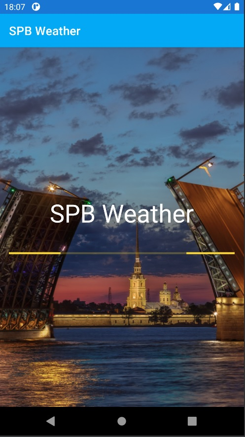
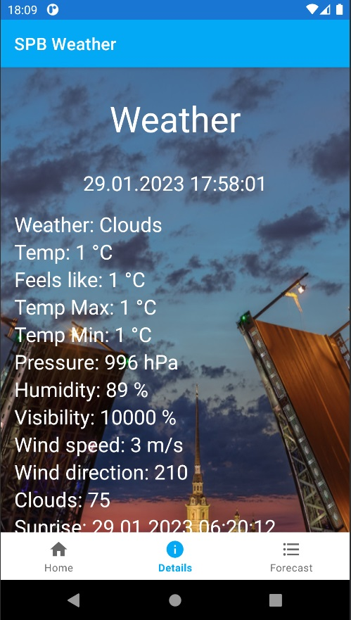
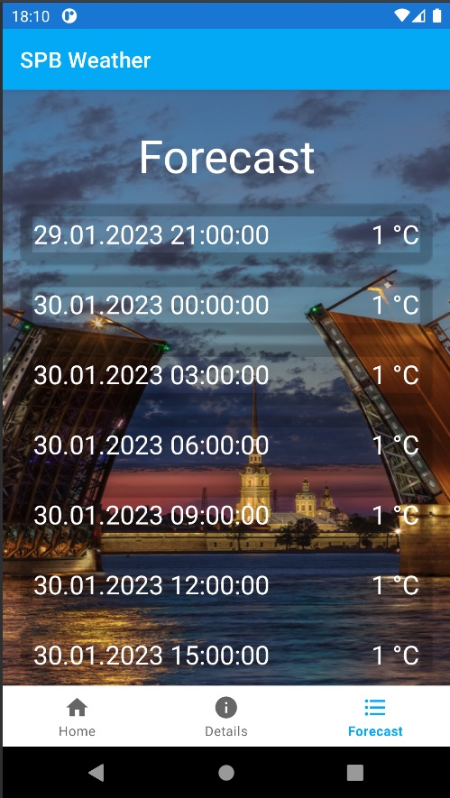

# О приложении

Тестовое задание на должность Junior Android Developer компании NwCode
---

# Возможности приложения

### 1. Главный экран (Home)

- на главнм экране отображается текущая температура в г.Санкт-Петербурге
- влажность
- скорость ветра
- атмосферное давление

### 2. Экран детальной информации (Details) - расширенная информация по погоде в г.Санкт-Петербурге

### 3. Прогноз погоды (Forecast) - прогноз на 5 дней с интервалом в 3 часа

---
# API: https://openweathermap.org/api

---
# Используемые технологии
- Kotlin
- Clean Architecture + MVVM + Single Activity
- Flow + LiveData
- Retrofit2
- Jetpack Navigation
- Hilt

